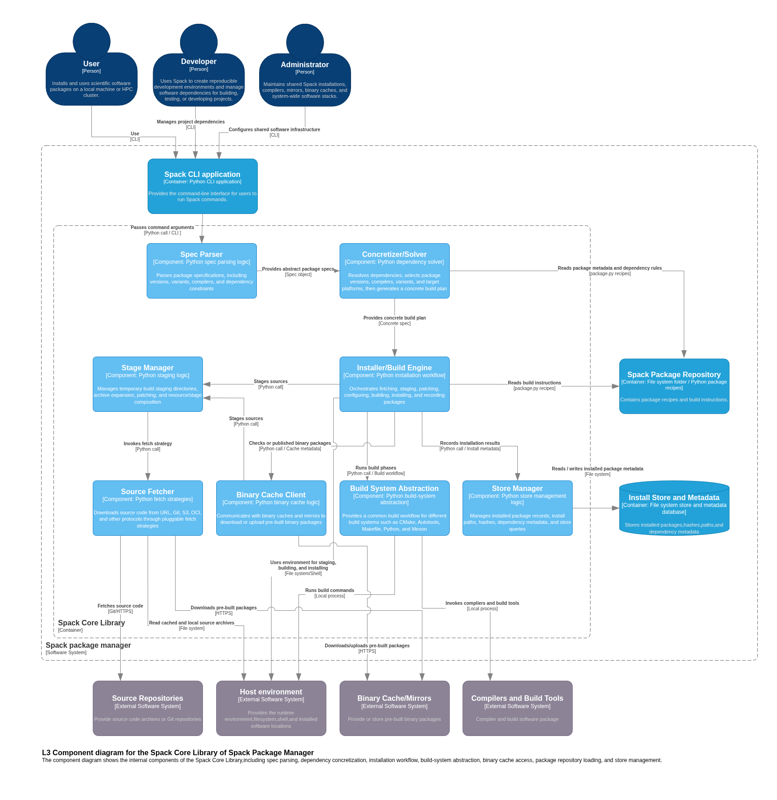

# Software Architecture Analysis

Software architecture report on the `spack` package management system.

## 1 - C4 Diagrams

We have conducted a review of the source code within `lib/spack/spack` in the spack GitHub repository. 

## 1.2 - Context Level (C4 L1)

## 1.3 - Container Level (C4 L2)

## 1.4 - Component Level (C4 L3)

## 2 - Architectural Characteristics / Qualities

## 3 - Summary

